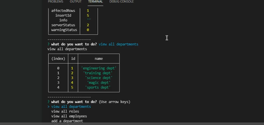

# Employee Management System
https://wingz003.github.io/Luigis-Employee-Management/

# Description
This is a data management system that allows you to view, filter and manipulate data in a sql database by the use of Inquirer scripts.

[

# Table of Contents
* [Installation](#installation)
* [Usage](#usage)
* [Contributions](#contributions)
* [Questions](#questions)

## Installation
### You will need to install the following dependencies prior to running the application: 

Inquirer and  Mysql2.

## Usage 
### Below are the following steps required to run this application: 

1. As soon as you input the command node index.js, a menu will pop up in the terminal with a series of options.

2. You will  be able to view every table in the database by the use of inquirer prompts.

3.You will also be able to add Employees, Roles and Departments.

4. **Updating roles** is also an option on this application!

## Contributions 

No contributions have been made.

## Questions
### If you have a questions or concerns, feel free to contact me at Lsanti618@gmail.com.
